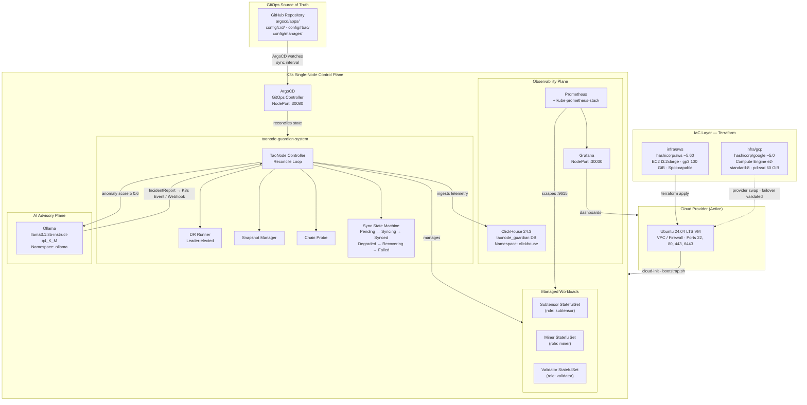

# 🛡️ TaoNode Guardian

[](https://go.dev/)
[](https://kubernetes.io/)
[](https://www.terraform.io/)
[](https://argo-cd.readthedocs.io/)
[](LICENSE)
[](https://github.com/ClaudioBotelhOSB/taonode-guardian/actions)

---

## 📌 Executive Summary

**TaoNode Guardian** is a production-grade Kubernetes Operator, written in Go, that manages the full lifecycle of [Bittensor](https://bittensor.com/) TAO network nodes — including **subtensor** validators, miners, and subnet participants.

### The Problem

Operating Bittensor infrastructure at scale presents three compounding failure modes:

1. **Sync drift** — nodes fall behind the canonical chain head, degrading validator rewards and miner performance without surfacing actionable signals.
2. **Operational fragility** — manual recovery procedures introduce human latency measured in hours, during which staked assets are at risk.
3. **Infrastructure lock-in** — hard dependencies on a single cloud provider create a single point of failure at the infrastructure layer itself.

### Design Philosophy

| Principle | Implementation |
|-----------|----------------|
| **GitOps-First** | ArgoCD is the sole mutation path to the cluster. Imperative `kubectl apply` is prohibited in steady-state operation. |
| **Zero-Touch Provisioning** | A single `terraform apply` bootstraps the full stack — K3s, ArgoCD, ClickHouse, Ollama — with no manual intervention required post-provisioning. |
| **Cloud-Agnostic by Design** | The Terraform provider is the only layer that changes between AWS and GCP. The K3s + ArgoCD control plane is identical on both. Multi-cloud failover has been validated in practice. |
| **Declarative Self-Healing** | The operator's reconciliation loop enforces desired state continuously. Sync drift, pod failures, and disk pressure trigger autonomous remediation without human escalation. |
| **Observability as a First-Class Citizen** | Every reconcile event is emitted as a structured ClickHouse record. Anomaly scoring runs in-loop. AI-assisted incident analysis fires automatically when anomaly thresholds are breached. |

---

## 📐 System Architecture



### Bootstrap Execution Order

The `bootstrap.sh` script executes deterministically in a fixed 12-step sequence on every cold start:

| Step | Component | Notes |
|------|-----------|-------|
| 1 | System deps + Helm + Kustomize + repo clone | `git clone --depth=1` |
| 2 | K3s install | Traefik and ServiceLB disabled; kubeconfig mode `644` |
| 3 | Node readiness gate | Polls until `kubectl wait nodes --for=condition=Ready` |
| 4–5 | cert-manager | Via Helm; 20 s webhook warm-up buffer |
| 6–7 | ArgoCD | Installed from upstream stable manifests; patched to NodePort `:30080` |
| 8 | kube-prometheus-stack | Grafana on NodePort `:30030`; scrape interval `30s` |
| 9 | OpenCost | FinOps cost attribution on NodePort `:30040` |
| 10 | ClickHouse | Altinity Operator; `taonode_guardian` database created in-loop |
| 11 | Ollama | `llama3.1:8b-instruct-q4_K_M` pre-pulled in background |
| 12 | CRDs + RBAC + Operator + Sample TaoNode | Idempotent `--dry-run=client` guards on all `create` calls |

---

## ⚙️ Design Decisions & Trade-offs

### K3s — Why a Lightweight Distribution

K3s was selected over kubeadm or managed Kubernetes (EKS/GKE) for the following reasons:

- **Single binary, single node.** For a PoC exercising operator logic, eliminating the multi-node control plane overhead removes the largest source of bootstrap complexity.
- **No Traefik, no ServiceLB.** The installation explicitly disables both (`--disable traefik --disable servicelb`), keeping the ingress story under operator control and avoiding port conflicts with the ArgoCD NodePort strategy.
- **k3s.yaml is idiomatic.** The kubeconfig produced at `/etc/rancher/k3s/k3s.yaml` is a standard kubeconfig, compatible with all downstream tooling (`helm`, `kubectl`, `argocd CLI`) without transformation.

**Trade-off:** K3s is not a production multi-node distribution. Promotion to production requires migrating to EKS, GKE, or RKE2 — with the ArgoCD application manifests migrating unmodified, since the operator's CRD and RBAC surface is Kubernetes-API-agnostic.

---

### ArgoCD — GitOps Reconciliation Engine

ArgoCD was selected as the sole CD mechanism based on the following constraints:

- **Reconciliation loop, not push-based CI.** Any drift between cluster state and the `argocd/apps/` manifests is detected and corrected autonomously, without re-triggering a pipeline.
- **Single source of truth enforcement.** By routing all changes through Git, audit trails are inherent — every cluster mutation has a corresponding commit.
- **Bootstrap compatibility.** ArgoCD can be bootstrapped by a shell script (`kubectl apply -f stable/install.yaml`) and becomes self-managing within one reconcile cycle, which fits the zero-touch provisioning model.

**Trade-off:** The self-signed TLS certificate on ArgoCD's NodePort necessitates either `--insecure` flag usage on the CLI or a cert-manager `ClusterIssuer` for production hardening.

---

### Multi-Cloud Strategy — Terraform Provider Pivot

The infrastructure abstraction is designed so that the only layer that changes between AWS and GCP is the Terraform provider block and its resource types. The guest OS (Ubuntu 24.04 LTS), K3s distribution, and ArgoCD application manifests are identical on both clouds.

**Validated execution matrix:**

| Cloud | Provider | Instance Type | Boot Mechanism | Status |
|-------|----------|--------------|----------------|--------|
| AWS | `hashicorp/aws ~5.60` | `t3.2xlarge` (8 vCPU / 32 GiB) | EC2 `user_data` via `cloud-init` | ✅ Primary |
| GCP | `hashicorp/google ~5.0` | `e2-standard-8` (8 vCPU / 32 GiB) | Compute Engine `metadata_startup_script` | ✅ Failover validated |

A pivot from AWS to GCP requires:
1. `cd infra/gcp && terraform init && terraform apply`
2. Extract kubeconfig from the new VM (see Quick Start).
3. ArgoCD auto-reconciles all application state from Git.

**No application-layer changes are required.** The K3s control plane, operator, and all Helm releases converge identically.

---

### Disaster Recovery & RPO/RTO

The `DisasterRecoverySpec` embedded in the `TaoNode` CRD defines contractual recovery targets at the resource level:

| Parameter | Default | Description |
|-----------|---------|-------------|
| `rpo` | `4h` | Maximum tolerable data loss window |
| `rto` | `30m` | Maximum tolerable downtime |
| `crdBackup.schedule` | `0 */2 * * *` | CRD manifest backup to object storage (every 2 hours) |
| `clickhouseDR.backupSchedule` | `0 3 * * *` | ClickHouse analytics backup (nightly at 03:00) |
| `chainDataDR.crossRegionReplication` | `false` | Enables cross-region snapshot replication when `true` |

The DR runner is leader-elected (using `controller-runtime`'s lease mechanism), preventing duplicate backup jobs in any future multi-replica operator deployment.

---

### Analytics Plane — ClickHouse vs. Prometheus

Prometheus handles real-time scraping (`:9615` per-node exporter, `30s` interval). ClickHouse handles **event-stream analytics**:

- Chain events (transfers, staking operations)
- Miner telemetry (reward decay, peer churn velocity)
- Reconcile audit records (every reconcile loop writes a structured row)

This separation decouples the alerting plane (Prometheus) from the analytics plane (ClickHouse), avoiding write amplification to Prometheus' TSDB for high-cardinality event data. Anomaly detection queries run against ClickHouse directly within the reconcile loop at a configurable `evaluationIntervalSeconds` (default: `60`).

---

### AI Advisory Plane — Ollama In-Cluster

Ollama runs as a cluster-internal service (`ClusterIP`), eliminating any dependency on external AI APIs. The operator calls Ollama only when a detected anomaly score exceeds `minAnomalyScoreForAdvisory` (default: `0.6`). The model (`llama3.1:8b-instruct-q4_K_M`) is a 4-bit quantized variant, calibrated to run on CPU within the memory limits allocated (`4 GiB request / 16 GiB limit`).

The incident report schema is structured (not freeform): `severity`, `summary`, `rootCauseCategory`, `recommendedAction`, `confidence` — all emitted as Kubernetes Events and optionally forwarded to Slack, PagerDuty, or Discord via Secret-referenced webhooks.

---

## 🚀 Quick Start — Environment Reproduction

### Prerequisites

| Tool | Version |
|------|---------|
| Terraform | `>= 1.9` |
| AWS CLI or `gcloud` | authenticated |
| `kubectl` | `>= 1.29` |
| `ssh` | Available in `PATH` |

---

### 1. Clone

```bash
git clone https://github.com/ClaudioBotelhOSB/taonode-guardian.git
cd taonode-guardian
```

---

### 2. Configure — AWS (Primary)

```bash
cd infra/aws
cp terraform.tfvars.example terraform.tfvars   # create from template
```

Edit `terraform.tfvars`:

```hcl
region         = "us-east-1"
instance_type  = "t3.2xlarge"
ssh_public_key = "ssh-ed25519 AAAA... your-public-key"
admin_cidrs    = ["<YOUR_EGRESS_IP>/32"]       # Restricts SSH + K3s API access
use_spot       = true                          # ~70% cost reduction vs on-demand
spot_price     = "0.15"
```

---

### 2a. Configure — GCP (Failover / Alternative)

```bash
cd infra/gcp
# Authenticate with application default credentials
gcloud auth application-default login
```

Edit `variables.tf` or pass via `-var`:

```hcl
project_id   = "your-gcp-project"
region       = "us-central1"
zone         = "us-central1-a"
machine_type = "e2-standard-8"
admin_cidrs  = ["<YOUR_EGRESS_IP>/32"]
```

---

### 3. Provision

```bash
terraform init
terraform plan -out=taonode.tfplan
terraform apply taonode.tfplan
```

The `bootstrap.sh` script executes automatically via `user_data` (AWS) or `metadata_startup_script` (GCP). Full bootstrap time: approximately **12–18 minutes**, depending on image pull latency for ClickHouse and Ollama.

Monitor bootstrap progress:

```bash
# AWS
ssh ubuntu@$(terraform output -raw instance_public_ip) \
  "tail -f /var/log/cloud-init-output.log"

# GCP
gcloud compute ssh ubuntu@vm-taonode-k3s --zone=us-central1-a -- \
  "sudo journalctl -u google-startup-scripts -f"
```

---

### 4. Extract Kubeconfig

```bash
PUBLIC_IP=$(terraform output -raw instance_public_ip)

scp ubuntu@${PUBLIC_IP}:/etc/rancher/k3s/k3s.yaml ~/.kube/taonode.yaml

# Rewrite server address from 127.0.0.1 to the public IP
sed -i "s/127.0.0.1/${PUBLIC_IP}/g" ~/.kube/taonode.yaml

export KUBECONFIG=~/.kube/taonode.yaml
kubectl get nodes -o wide
```

---

### 5. Access Services via SSH Tunnel

All NodePort services are **not exposed** to the public internet. Access is exclusively via SSH forwarding:

```bash
# Grafana
ssh -N -L 30030:localhost:30030 ubuntu@${PUBLIC_IP} &

# ArgoCD
ssh -N -L 30080:localhost:30080 ubuntu@${PUBLIC_IP} &

# OpenCost
ssh -N -L 30040:localhost:30040 ubuntu@${PUBLIC_IP} &
```

| Service | Local URL |
|---------|-----------|
| Grafana | http://localhost:30030 |
| ArgoCD | https://localhost:30080 |
| OpenCost | http://localhost:30040 |

Retrieve the ArgoCD admin password:

```bash
kubectl get secret argocd-initial-admin-secret -n argocd \
  -o jsonpath="{.data.password}" | base64 -d
```

---

### 6. Verify Operator State

```bash
# Check TaoNode resources (shortname: tn)
kubectl get tn -A

# Sample output
# NAMESPACE                    NAME             NETWORK   ROLE    SUBNET  PHASE    SYNC      BLOCK       LAG   PEERS   AGE
# taonode-guardian-system      miner-demo-sn1   testnet   miner   1       Synced   in-sync   4521300     0     12      8m
```

---

## 🗂️ Repository Structure

```
taonode-guardian/
├── api/v1alpha1/               # CRD type definitions (TaoNode, 34 sub-types)
│   ├── taonode_types.go        # Spec + Status structs with kubebuilder markers
│   └── taonode_webhook.go      # Defaulting + validation admission webhook
├── internal/
│   └── controller/
│       ├── taonode_controller.go    # Main reconcile loop
│       ├── sync_state_machine.go    # FSM: Pending→Syncing→Synced→Degraded→Recovering→Failed
│       ├── snapshot_manager.go      # Snapshot scheduling + S3/GCS upload
│       ├── dr_runner.go             # Leader-elected DR backup goroutine
│       ├── chain_probe.go           # HTTP health probe against :9616/health
│       ├── workload_manager.go      # StatefulSet lifecycle management
│       ├── validator_guard.go       # Slashing protection + key management
│       ├── metrics.go               # Prometheus counter/gauge registration
│       └── finops_estimator.go      # Real-time infrastructure cost estimation
├── internal/ai/                # Ollama client + IncidentReport schema
├── internal/analytics/         # ClickHouse client + ingestion pipeline
├── infra/
│   ├── aws/                    # Terraform: EC2, VPC, SG, Key Pair, Spot config
│   └── gcp/                    # Terraform: Compute Engine, VPC, Firewall Rules
├── argocd/apps/                # ArgoCD Application manifests
├── config/
│   ├── crd/bases/              # Generated CRD YAML (kubebuilder output)
│   ├── rbac/                   # ClusterRole + ServiceAccount manifests
│   └── manager/                # Operator Deployment manifest
├── cmd/                        # Operator entrypoint + DR CLI binary
├── .github/workflows/
│   ├── ci.yaml                 # Build, test, lint, cover
│   ├── release.yaml            # GoReleaser — operator + tao-dr binaries
│   └── release-please.yml      # Automated changelog and version bumping
└── Makefile                    # generate, manifests, docker-build, deploy targets
```

---

## 🔒 Security Posture

### Network Boundary

Ingress to both AWS and GCP deployments is restricted by firewall policy at the provider level:

| Port | Protocol | Exposed To | Purpose |
|------|----------|-----------|---------|
| 22 | TCP | `admin_cidrs` only | SSH access |
| 6443 | TCP | `admin_cidrs` only | K3s API server |
| 80 | TCP | `0.0.0.0/0` | HTTP (redirect only) |
| 443 | TCP | `0.0.0.0/0` | HTTPS |

NodePort services (Grafana `:30030`, ArgoCD `:30080`, OpenCost `:30040`) are **not in the security group/firewall rule set**. They are exclusively reachable via SSH tunnel. This eliminates the attack surface for all internal dashboards.

### Secret Management

| Secret | Storage | Injection Method |
|--------|---------|-----------------|
| Grafana admin password | `/var/lib/taonode-guardian/grafana-admin-password` (mode `600`) | Generated with `/dev/urandom` at bootstrap; never hardcoded |
| ClickHouse password | `/var/lib/taonode-guardian/clickhouse-password` (mode `600`) | Generated with `/dev/urandom` at bootstrap; mounted as Kubernetes Secret |
| Validator hot key | Kubernetes Secret (`hotKeySecret`) | Operator reads at reconcile time; supports ESO (Vault, AWS Secrets Manager, GCP Secret Manager) |
| Validator cold key | External Secrets Operator (`coldKeyVaultRef`) | Never lands in etcd as plaintext |
| Webhook URLs (Slack, PagerDuty, Discord) | Kubernetes Secrets | Referenced by name in `NotificationChannels`; never interpolated in manifests |

### GitHub Token Scope

The Personal Access Token embedded in `bootstrap.sh` for the initial `git clone` is a **fine-grained token** scoped to:
- `Contents: Read` on the `taonode-guardian` repository only.

No write permissions, no organization-level access, no package registry access.

> **Rotation:** The token should be rotated after the bootstrap clone completes and the cluster is in steady-state operation under ArgoCD's sync. ArgoCD maintains its own Git credentials independently.

### Kubernetes RBAC

The operator's `ServiceAccount` is granted the minimum set of cluster permissions required by the reconcile loop:

- `TaoNode` (custom resource): `get`, `list`, `watch`, `update`, `patch`
- `StatefulSets`, `Services`, `PersistentVolumeClaims`: `get`, `list`, `watch`, `create`, `update`, `patch`, `delete`
- `Events`: `create`, `patch`
- `Lease` (leader election): `get`, `create`, `update`
- **No `ClusterAdmin`, no `*` verbs.**

---

## 📊 Operator — Reconcile Loop Summary

The controller implements the `controller-runtime` `Reconciler` interface with the following planes active per reconcile:

```
Reconcile(ctx, req)
 ├── Fetch TaoNode CR
 ├── ChainProbe          → GET :9616/health → SyncState, BlockLag, PeerCount
 ├── SyncStateMachine    → Evaluate phase transition (FSM)
 ├── WorkloadManager     → StatefulSet create/update/scale
 ├── StorageManager      → PVC sizing, AutoExpand threshold check
 ├── SnapshotManager     → Cron evaluation, upload to S3/GCS
 ├── ValidatorGuard      → Slashing protection, MaxConcurrentValidators enforcement
 ├── GPUAdvisor          → GPU resource requests + FallbackToCPU logic
 ├── FinOpsEstimator     → EstimatedMonthlyUSD computation → status patch
 ├── AnalyticsPipeline   → Batch flush to ClickHouse (events + reconcile audit)
 ├── AnomalyDetector     → ClickHouse queries → AnomalyScoreStatus[]
 ├── AIAdvisor           → Ollama call (if score ≥ threshold) → IncidentReport
 ├── MetricsExporter     → Prometheus counter/gauge update
 └── StatusPatch         → Write observed state back to TaoNode.Status
```

Rate limiting: `controller-runtime`'s `workqueue.DefaultTypedControllerRateLimiter` with exponential back-off. The operator registers two managers: the reconcile controller and the DR runner (conditionally, when `spec.disasterRecovery.enabled=true` and `BACKUP_BUCKET` env var is set).

---

## 📦 Releases

Releases are managed via [Release Please](https://github.com/googleapis/release-please) and [GoReleaser](https://goreleaser.com/). Two binaries are produced per release:

| Binary | Description |
|--------|-------------|
| `taonode-guardian` | The Kubernetes Operator binary |
| `tao-dr` | Standalone Disaster Recovery CLI for offline backup operations |

Container images are published to `ghcr.io/claudiobotelhosb/taonode-guardian`.

---

## License

Copyright 2026 Claudio Botelho. Licensed under the [Apache License, Version 2.0](LICENSE).
