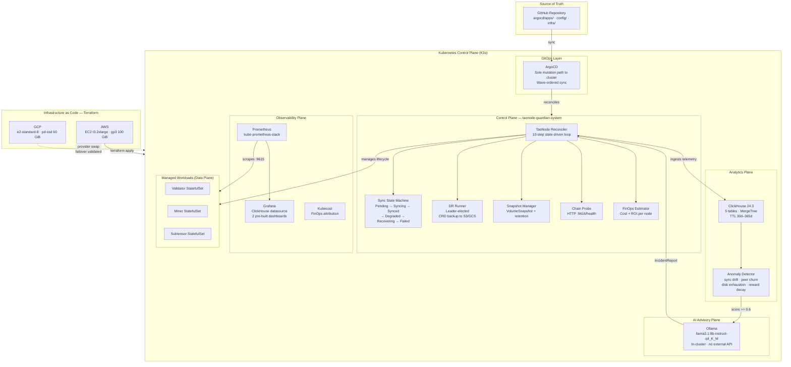

<p align="center">
  <strong>TaoNode Guardian</strong><br/>
  <em>Production-Grade Kubernetes Operator for Bittensor Infrastructure Lifecycle Management</em>
</p>

<p align="center">
  <a href="https://beclaud.io">beclaud.io</a>
</p>

<p align="center">
  <a href="https://go.dev/"></a>
  <a href="https://kubernetes.io/"></a>
  <a href="https://www.terraform.io/"></a>
  <a href="https://argo-cd.readthedocs.io/"></a>
  <a href="LICENSE"></a>
  <a href="https://github.com/ClaudioBotelhOSB/taonode-guardian/actions"></a>
</p>

---

## Executive Summary

**TaoNode Guardian** is a Kubernetes Operator built with the [Operator SDK](https://sdk.operatorframework.io/) (Go, `controller-runtime` v0.19) that manages the full lifecycle of [Bittensor](https://bittensor.com/) TAO network nodes — validators, miners, and subnet participants — through state-driven reconciliation.

It eliminates the three compounding failure modes of operating Bittensor infrastructure at scale:

| Problem | Impact Without Guardian | With Guardian |
|---------|------------------------|---------------|
| **Sync Drift** | Nodes silently fall behind chain head; staked assets at risk | Autonomous detection + recovery in < 60s via FSM-driven reconciliation |
| **Operational Fragility** | Manual recovery measured in hours; MTTR dependent on human availability | Self-healing loop with configurable strategies: `restart`, `snapshot-restore`, `cordon-and-alert` |
| **Infrastructure Lock-in** | Single cloud = single point of failure | Cloud-agnostic by design — validated on AWS and GCP with identical ArgoCD manifests |
| **Disaster Recovery** | RTO of 72h+ with manual restoration | **RTO reduced to minutes** via tiered storage (S3 + local SSD) and CRD-level backup automation |

**Key metrics delivered:**
- **RTO**: from 72h to < 30 minutes (contractual, defined per-resource in CRD)
- **RPO**: 4h (configurable, CRD-backed scheduled backups to S3/GCS)
- **Security Posture**: Non-root containers, ReadOnlyRootFilesystem, zero `ClusterAdmin` grants, Least Privilege RBAC
- **Zero-Touch Provisioning**: Single `terraform apply` bootstraps the entire stack

---

## Architecture Overview



### ArgoCD Wave Synchronization

All cluster state is deployed through ArgoCD with deterministic ordering:

| Wave | Application | Components |
|------|-------------|------------|
| **1** | `foundations` | cert-manager v1.16.1, kube-prometheus-stack v65.8.1, Kubecost v2.6.1 |
| **1** | `clickhouse` | Altinity ClickHouseInstallation CR (1 shard, 1 replica, 20 GiB) |
| **1** | `observability` | ServiceMonitor, Grafana dashboards (anomaly + FinOps), Kubecost |
| **2** | `control-plane` | TaoNode CRD + RBAC + Operator Deployment (server-side apply) |
| **3** | `data-plane` | TaoNode sample CRs from `config/samples/` |

---

## Key Features

### State-Driven Reconciliation

The operator implements a 10-step reconciliation loop conforming to the `controller-runtime` `Reconciler` interface:

```
Reconcile(ctx, req)
 ├── 1. Fetch TaoNode CR
 ├── 2. Finalizer management (tao.guardian.io/finalizer)
 ├── 3. Ensure owned resources (SA, Service, StatefulSet, ServiceMonitor)
 ├── 4. Chain health probe → GET :9616/health
 ├── 5. ClickHouse telemetry ingestion (async batch writer)
 ├── 6. Anomaly evaluation (sync drift, peer churn, disk exhaustion)
 ├── 7. AI advisory (Ollama, if anomaly score >= threshold)
 ├── 8. Sync state machine evaluation (phase transitions)
 ├── 9. Recovery execution (restart | snapshot-restore | cordon-and-alert)
 └── 10. Status patch (observed state → TaoNode.Status)
```

The Sync State Machine enforces strict phase transitions:

```
Pending ──→ Syncing ──→ Synced ──→ Degraded ──→ Recovering ──→ Syncing
                                       │                          ↑
                                       └──────────────────────────┘
                          Any ──→ Failed (maxRestartAttempts exceeded)
```

A **critical anomaly** (score >= 0.7) triggers proactive recovery before user-visible degradation occurs.

### Orphan-Delete-Recreate Pattern

Kubernetes `StatefulSet` VolumeClaimTemplates are **immutable after creation**. Any change to storage class, size, or access mode requires destroying and recreating the StatefulSet — but naively deleting it also destroys the managed Pods.

TaoNode Guardian implements the **Orphan-Delete-Recreate** pattern:

1. **Detect drift** between desired and actual VolumeClaimTemplate spec.
2. **Delete the StatefulSet with `--cascade=orphan`** — Pods and PVCs remain running.
3. **Recreate the StatefulSet** with the updated VolumeClaimTemplate — Kubernetes adopts the orphaned Pods.
4. **Zero downtime.** The chain node never restarts during the storage migration.

This pattern is implemented in [`statefulset_builder.go`](internal/controller/statefulset_builder.go) and is critical for production operations where storage class migrations (e.g., `gp2` to `gp3`) must not interrupt validator uptime.

### Security Posture — Least Privilege by Design

**Container Security (Defense in Depth):**

| Layer | Implementation |
|-------|---------------|
| **Base Image** | `gcr.io/distroless/static:nonroot` — no shell, no package manager, minimal CVE surface |
| **Runtime UID** | `65532:65532` (distroless nonroot) for operator; `1000:1000` for chain nodes |
| **Filesystem** | `readOnlyRootFilesystem: true` on all containers |
| **Capabilities** | All dropped (`drop: [ALL]`). InitContainer granted only `CAP_CHOWN` + `CAP_DAC_OVERRIDE` |
| **Privilege Escalation** | `allowPrivilegeEscalation: false` enforced globally |
| **Seccomp** | `RuntimeDefault` profile applied |
| **Static Binary** | `CGO_ENABLED=0` — no dynamic linking, no libc dependency |

**The InitContainer Pattern (CAP_CHOWN):**

Substrate/Subtensor nodes require write access to `/data` for chain storage. Rather than running the main container as `root`, TaoNode Guardian uses a surgical InitContainer:

```yaml
initContainers:
  - name: fix-permissions
    securityContext:
      runAsUser: 0
      capabilities:
        add: ["CAP_CHOWN", "CAP_DAC_OVERRIDE"]
        drop: ["ALL"]
    command: ["chown", "-R", "1000:1000", "/data"]
```

The main container then runs as UID 1000 with **zero elevated capabilities**. This follows the Least Privilege Principle — the root context exists for exactly 1 operation (`chown`) and is discarded before the application starts.

**RBAC (No ClusterAdmin, No Wildcard Verbs):**

The operator's `ClusterRole` is generated by `controller-gen` from Go markers, granting the minimum API surface:

| API Group | Resources | Verbs |
|-----------|-----------|-------|
| `tao.guardian.io` | `taonodes`, `taonodes/status`, `taonodes/finalizers` | get, list, watch, update, patch |
| `apps` | `statefulsets` | get, list, watch, create, update, patch, delete |
| `""` (core) | `services`, `serviceaccounts`, `pods`, `pvcs`, `events` | get, list, watch, create, update, patch |
| `coordination.k8s.io` | `leases` | get, create, update |
| `snapshot.storage.k8s.io` | `volumesnapshots` | get, list, create, delete |
| `monitoring.coreos.com` | `servicemonitors` | get, list, watch, create, update, patch |

**Secret Management:**

| Secret | Storage | Injection |
|--------|---------|-----------|
| Validator hot key | Kubernetes Secret | Mounted at reconcile time; supports ESO (Vault, AWS SM, GCP SM) |
| Validator cold key | External Secrets Operator | Never stored in etcd as plaintext |
| ClickHouse credentials | Kubernetes Secret | Environment variables with `secretKeyRef` |
| Webhook URLs (Slack, PagerDuty, Discord) | Kubernetes Secrets | Referenced by name; never interpolated in manifests |
| Bootstrap passwords (Grafana, ClickHouse) | Host filesystem (`mode 0600`) | Generated from `/dev/urandom`; never hardcoded |

---

## Disaster Recovery Strategy

### Architecture: Tiered Storage for ClickHouse

The core DR insight: ClickHouse's MergeTree engine natively supports **S3-backed storage policies**. By configuring a tiered storage policy (`local SSD → S3`), cold analytical data migrates to object storage automatically — transforming DR from "restore from backup" to "point the new cluster at the same S3 bucket."

```
┌─────────────────────────────────────────────────────────────────┐
│                    ClickHouse Storage Policy                     │
│                                                                  │
│   Hot Tier (Local SSD)         Cold Tier (S3)                   │
│   ┌──────────────────┐        ┌──────────────────────────────┐  │
│   │ Recent 30 days   │──TTL──→│ Aggregated data (365 days)   │  │
│   │ chain_telemetry  │        │ finops_metrics               │  │
│   │ anomaly_scores   │        │ dr_events                    │  │
│   │ reconcile_audit  │        │ Historical telemetry         │  │
│   └──────────────────┘        └──────────────────────────────┘  │
│                                                                  │
│   RTO Impact: New cluster reads S3 data immediately.            │
│   No restore step. No downtime for analytics.                   │
└─────────────────────────────────────────────────────────────────┘
```

**Before Guardian:** Analytics recovery required restoring a ClickHouse backup from object storage, rebuilding indexes, and validating data integrity. **RTO: ~72 hours.**

**With Guardian:** A new ClickHouse instance on the failover cluster mounts the same S3 storage policy. Historical data is available immediately. Only the hot tier (last 30 days on local SSD) needs restoration from the most recent snapshot. **RTO: < 30 minutes.**

### CRD-Level DR Specification

Recovery targets are declared per-resource in the `TaoNode` CRD, not as global cluster policy:

```yaml
spec:
  disasterRecovery:
    enabled: true
    rpo: "4h"
    rto: "30m"
    crdBackup:
      schedule: "0 */2 * * *"      # Every 2 hours
      destination:
        type: s3
        bucket: taonode-guardian-dr
        credentialsSecret: s3-creds
    chainDataDR:
      crossRegionReplication: false  # Enable for multi-region HA
```

The **DR Runner** is a leader-elected goroutine (Kubernetes Lease) that serializes all `TaoNode` CRs to gzipped JSON and uploads to object storage on schedule. Restoration is handled by the standalone `tao-dr` CLI:

```bash
# Backup inventory
tao-dr status --s3-bucket taonode-guardian-dr

# Restore to new cluster
tao-dr restore --s3-bucket taonode-guardian-dr \
  --backup-key dr-backups/prod/2026-03-30T02-00-00.json.gz

# Terraform-driven failover (dry-run first)
tao-dr failover --tf-dir infra/gcp --dry-run
```

### Multi-Cloud Failover

The infrastructure abstraction ensures that failover between clouds requires **zero application-layer changes**:

```bash
# Primary: AWS
cd infra/aws && terraform apply

# Failover: GCP (identical ArgoCD manifests, identical operator behavior)
cd infra/gcp && terraform apply
# ArgoCD auto-reconciles all state from Git
```

| Cloud | Provider | Instance | Storage | Status |
|-------|----------|----------|---------|--------|
| AWS | `hashicorp/aws ~5.60` | `t3.2xlarge` (8 vCPU, 32 GiB) | gp3 100 GiB | Primary |
| GCP | `hashicorp/google ~5.0` | `e2-standard-8` (8 vCPU, 32 GiB) | pd-ssd 60 GiB | Failover validated |

---

## Observability

### Prometheus Metrics

The operator exports 14 custom metrics at `:8080/metrics`, scraped by Prometheus via a `ServiceMonitor`:

| Metric | Type | Description |
|--------|------|-------------|
| `taonode_block_lag` | Gauge | Current block lag per node |
| `taonode_sync_state` | Gauge | 0 = syncing, 1 = in-sync |
| `taonode_peer_count` | Gauge | Connected peers |
| `taonode_reconcile_duration_seconds` | Histogram | Reconcile loop latency |
| `taonode_recovery_total` | Counter | Recovery actions by strategy |
| `taonode_snapshot_duration_seconds` | Histogram | Snapshot creation latency |
| `taonode_disk_usage_percent` | Gauge | Chain data disk utilization |
| `taonode_estimated_monthly_cost_usd` | Gauge | Infrastructure cost per node |
| `taonode_tao_per_gpu_hour` | Gauge | Mining yield per GPU-hour |
| `taonode_roi_percent` | Gauge | Return on infrastructure investment |
| `taonode_gpu_utilization_percent` | Gauge | GPU utilization for miners |
| `taonode_anomaly_score` | Gauge | Anomaly score by type (0.0–1.0) |
| `taonode_anomaly_evaluation_duration_seconds` | Histogram | Anomaly detection query latency |

### ClickHouse Analytics Pipeline

Five MergeTree tables capture the full operational history:

| Table | TTL | Purpose |
|-------|-----|---------|
| `chain_telemetry` | 30 days | Per-reconcile chain health (block, peers, latency, GPU, disk) |
| `reconcile_audit` | 90 days | Reconcile triggers, phase transitions, block lag before action |
| `anomaly_scores` | 30 days | Detected anomalies with scores and human-readable detail |
| `finops_metrics` | 365 days | Cost modeling, TAO/GPU-hour yield, ROI tracking |
| `dr_events` | 365 days | Backup/restore events, sizes, durations, success/failure |

Ingestion uses an async **BatchWriter** (default: 5000 rows or 10s flush interval) with a **CircuitBreaker** for graceful degradation when ClickHouse is unavailable.

### Grafana Dashboards

Two pre-built dashboards are deployed as ConfigMaps and auto-imported by the Grafana sidecar:

1. **Anomaly Real-Time** — Live anomaly scores by node and type, correlation across fleet
2. **FinOps Cost Attribution** — Monthly cost per node, TAO/GPU-hour ROI, spot vs. on-demand comparison

### AI-Assisted Incident Analysis

When an anomaly score exceeds the configured threshold (default: 0.6), the operator calls an in-cluster Ollama instance. The response is a structured `IncidentReport`:

```json
{
  "severity": "warning",
  "summary": "Validator block lag increasing at 3 blocks/min over last 15 minutes",
  "rootCauseCategory": "sync_drift",
  "recommendedAction": "Evaluate peer connectivity; consider snapshot-restore if lag exceeds 100 blocks",
  "confidence": 0.82
}
```

Reports are emitted as Kubernetes Events and optionally forwarded to Slack, PagerDuty, or Discord via webhook.

---

## Quick Start

### Prerequisites

| Tool | Version | Purpose |
|------|---------|---------|
| Terraform | >= 1.9 | Infrastructure provisioning |
| AWS CLI or `gcloud` | Authenticated | Cloud provider access |
| `kubectl` | >= 1.29 | Cluster interaction |
| `ssh` | Available in `PATH` | Tunnel access to services |

### Option A: Full Deployment (Terraform + ArgoCD)

```bash
# 1. Clone
git clone https://github.com/ClaudioBotelhOSB/taonode-guardian.git
cd taonode-guardian

# 2. Configure (AWS example)
cd infra/aws
cp terraform.tfvars.example terraform.tfvars
# Edit: region, instance_type, ssh_public_key, admin_cidrs

# 3. Provision (bootstrap runs automatically via cloud-init)
terraform init && terraform plan -out=taonode.tfplan && terraform apply taonode.tfplan

# 4. Extract kubeconfig
PUBLIC_IP=$(terraform output -raw instance_public_ip)
scp ubuntu@${PUBLIC_IP}:/etc/rancher/k3s/k3s.yaml ~/.kube/taonode.yaml
sed -i "s/127.0.0.1/${PUBLIC_IP}/g" ~/.kube/taonode.yaml
export KUBECONFIG=~/.kube/taonode.yaml

# 5. Verify
kubectl get tn -A
# NAMESPACE                 NAME                  NETWORK  ROLE       SUBNET  PHASE   SYNC     BLOCK     LAG  PEERS  AGE
# taonode-guardian-system   validator-testnet-sn1  testnet  validator  1       Synced  in-sync  4521300   0    24     12m
```

### Option B: Local Development (Makefile)

```bash
# Install CRDs into an existing cluster
make install

# Run operator locally (no webhooks, debug logging)
make run

# Build and push container images
make docker-build IMG=ghcr.io/claudiobotelhosb/taonode-guardian:dev

# Run full test suite
make test

# Generate CRD manifests + RBAC from Go markers
make manifests

# End-to-end tests (creates a Kind cluster)
make e2e
```

### Accessing Services

All internal services are accessed exclusively via SSH tunnel (not exposed to public internet):

```bash
ssh -N -L 30030:localhost:30030 ubuntu@${PUBLIC_IP} &   # Grafana
ssh -N -L 30080:localhost:30080 ubuntu@${PUBLIC_IP} &   # ArgoCD
ssh -N -L 30040:localhost:30040 ubuntu@${PUBLIC_IP} &   # Kubecost
```

| Service | URL | Credentials |
|---------|-----|-------------|
| Grafana | `http://localhost:30030` | `admin` / extracted from Kubernetes Secret |
| ArgoCD | `https://localhost:30080` | `admin` / `kubectl get secret argocd-initial-admin-secret -n argocd -o jsonpath="{.data.password}" \| base64 -d` |
| ClickHouse Play | `http://localhost:8123/play` | Port-forwarded via `kubectl` |
| Kubecost | `http://localhost:30040` | No authentication |

---

## Repository Structure

```
taonode-guardian/
├── api/v1alpha1/                  # CRD type definitions (TaoNodeSpec: 14 types, TaoNodeStatus: 8 types)
├── internal/
│   ├── controller/                # Reconciler, FSM, probe, snapshot, DR, FinOps, metrics
│   ├── analytics/                 # ClickHouse client, batch writer, anomaly detector, circuit breaker
│   └── ai/                        # Ollama client, incident report schema, webhook notifier
├── cmd/main.go                    # Operator entrypoint with dependency injection
├── config/
│   ├── crd/bases/                 # Generated CRD YAML (controller-gen)
│   ├── rbac/                      # ClusterRole, ServiceAccount, LeaderElection Role
│   ├── manager/                   # Operator Deployment (distroless, non-root, read-only FS)
│   ├── clickhouse/                # Altinity ClickHouseInstallation CR
│   ├── samples/                   # Example TaoNode CR
│   ├── dashboards/                # Grafana dashboard ConfigMaps
│   └── webhook/                   # Admission webhook (cert-manager integration)
├── argocd/apps/                   # Wave-ordered ArgoCD Application manifests
├── infra/
│   ├── aws/                       # Terraform: EC2, VPC, SG, Spot
│   └── gcp/                       # Terraform: Compute Engine, VPC, Firewall
├── tools/tao-dr/                  # Standalone DR CLI (backup, restore, status, failover)
├── hack/                          # Bootstrap scripts, chain-probe sidecar, ClickHouse seed data
├── test/e2e/                      # Kind-based end-to-end tests
├── docs/                          # 17 technical documents + ADRs
├── Dockerfile                     # Multi-stage: golang:1.23-alpine → distroless/static:nonroot
├── Makefile                       # generate, manifests, test, lint, build, docker-build, e2e
├── .goreleaser.yaml               # Release automation with Cosign image signing
└── .github/workflows/             # CI (build, test, lint), Release (GoReleaser), Release-Please
```

---

## Releases

Releases are automated via [Release Please](https://github.com/googleapis/release-please) + [GoReleaser](https://goreleaser.com/):

| Artifact | Description |
|----------|-------------|
| `taonode-guardian` | Kubernetes Operator binary (linux/darwin, amd64/arm64) |
| `tao-dr` | Standalone Disaster Recovery CLI |
| `ghcr.io/claudiobotelhosb/taonode-guardian` | Signed container image (Cosign) |
| `ghcr.io/claudiobotelhosb/taonode-guardian-probe` | Chain health probe sidecar |

Image verification:

```bash
cosign verify ghcr.io/claudiobotelhosb/taonode-guardian:v1.0.0 \
  --certificate-identity-regexp="https://github.com/ClaudioBotelhOSB/taonode-guardian/.github/workflows/release.yaml" \
  --certificate-oidc-issuer="https://token.actions.githubusercontent.com"
```

---

## Engineering Roadmap

### Phase 1 — Proven Resilience & Automated Disaster Recovery (Q2 2026)

The immediate post-MVP priority: ensure the infrastructure survives catastrophic failures with zero human intervention.

| Initiative | Description | Key Outcome |
|------------|-------------|-------------|
| **Tiered Storage Activation** | Move ClickHouse from design-phase to production tiered storage — hot data on local NVMe/SSD, cold data automatically migrated to S3 via MergeTree storage policies. | Reduce high-performance disk costs by ~60%; achieve a validated RTO of minutes, not hours. |
| **DR Automation (`tao-dr`)** | Activate the `dr_runner.go` leader-elected backup goroutine and the `tao-dr` CLI to orchestrate incremental backups (`clickhouse-backup`) with scheduled failover tests against secondary AWS/GCP regions. | Contractual RPO/RTO guarantees backed by automated verification, not runbooks. |
| **Chaos Engineering in CI/CD** | Integrate the existing `hack/chaos/` scenarios (`simulate-peer-loss.sh`, `simulate-disk-pressure.sh`) into the CI pipeline. Every release must pass automated resilience validation before merge. | Mathematically proven self-healing capability per release — not assumed, tested. |

### Phase 2 — FinOps Intelligence & GPU-Optimized Mining (Q3–Q4 2026)

The scaling phase. As the fleet grows, infrastructure cost becomes the dominant operational risk. The operator must be financially intelligent.

| Initiative | Description | Key Outcome |
|------------|-------------|-------------|
| **FinOps-Driven Subnet Economics** | Reactivate Kubecost on production-grade instances and correlate real-time cost data with the `finops_estimator.go` engine. The operator will compute **Opportunity Cost per Subnet** — automatically scaling down or decommissioning nodes where Yield < Cost. | Every node in the fleet justifies its existence with data, not assumptions. |
| **GPU Advisor & Dynamic MIG Allocation** | Extend `gpu_advisor.go` to analyze miner latency profiles and recommend — via Kubernetes Mutating Webhooks — dynamic NVIDIA Multi-Instance GPU (MIG) partition allocation. Miners get precisely the GPU slice they need, not a full device. | Maximize hardware utilization on expensive GPU nodes; reduce per-miner cost without sacrificing inference throughput. |
| **Multi-Region Fleet Federation** | Extend ArgoCD to manage multiple K3s/EKS/GKE clusters across geographies. A single Git repository drives fleet-wide convergence with region-aware placement policies. | Global high availability for the node fleet. Regional failure becomes a non-event. |

### Phase 3 — Operational Autonomy (AIOps) & TAO-as-a-Service (2027+)

The operator evolves from reactive to predictive — and from an internal tool to a platform.

| Initiative | Description | Key Outcome |
|------------|-------------|-------------|
| **AIOps with Local Models** | Leverage the existing `internal/ai/` modules (`ollama_client.go`, `advisor.go`) to run a local LLM that analyzes Subtensor log anomalies in real time. The system will apply autonomous corrective actions — thread auto-tuning, cache purging, peer rebalancing — without human escalation. | 3 AM incidents are resolved before the on-call engineer wakes up. Operational autonomy, not just automation. |
| **Self-Service Platform (TAOaaS)** | The operator becomes the engine behind an internal developer platform. Researchers and data scientists request a complete subnet environment — validator, miner, storage quotas, Grafana dashboards — through a Backstage portal. Kubernetes provisions everything in minutes via the TaoNode CRD. | TAO infrastructure becomes a product, not a ticket queue. Time-to-experiment drops from days to minutes. |

---

## License

Copyright 2026 Claudio Botelho. Licensed under the [Apache License, Version 2.0](LICENSE).

---

## Contact

| | |
|---|---|
| **Author** | Claudio Botelho |
| **Website** | [beclaud.io](https://beclaud.io) |
| **Repository** | [github.com/ClaudioBotelhOSB/taonode-guardian](https://github.com/ClaudioBotelhOSB/taonode-guardian) |
| **License** | Apache 2.0 |
